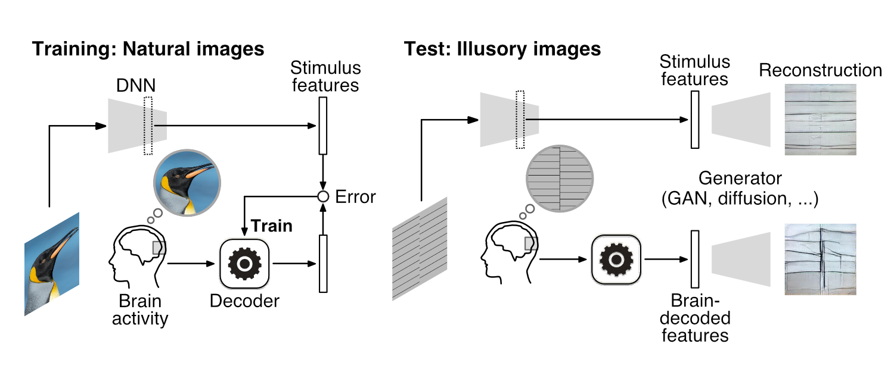
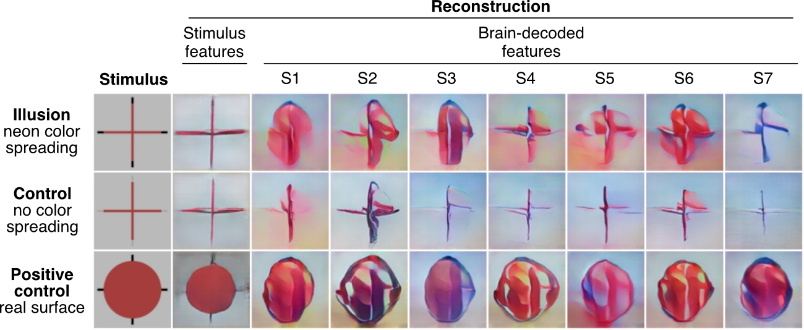

<!-- Improved compatibility of back to top link: See: https://github.com/othneildrew/Best-README-Template/pull/73 -->
<a name="readme-top"></a>


<!-- PROJECT SHIELDS -->
[![Contributors][contributors-shield]][contributors-url]
[![Forks][forks-shield]][forks-url]
[![Stargazers][stars-shield]][stars-url]
[![Issues][issues-shield]][issues-url]


<br />

<h2 align="center">Reconstructing visual illusory experiences from human brain activity</h2>

  <p align="center">
    Fan Cheng, Tomoyasu Horikawa, Kei Majima, Misato Tanaka, Mohamed Abdelhack, Shuntaro C. Aoki, Jin Hirano, Yukiyasu Kamitani
    <br />
    <a href="https://github.com/KamitaniLab/IllusionReconstruction">Paper</a>
    ·
    <a href="https://2022.ccneuro.org/view_paper.php?PaperNum=1149">CCN2022</a>
    ·
    <a href="https://doi.org/10.1101/2023.06.15.545037">bioRxiv</a>
  
<div align="center">
  <a href="https://github.com/KamitaniLab/IllusionReconstruction/blob/main/">
    
  </a> 
</div>


## Getting Started

### Installation

Clone the repo:
   ```sh
   git clone https://github.com/KamitaniLab/IllusionReconstruction.git
   ```

### Build Environment

Step1: Navigate to the base directory and create the environment by running the following command.
  ```sh
  conda env create -f env.yaml

  ```
Step2: Activate the environment.
  ```sh
  conda activate brain_decoding-to-generator
  
  ```

### Download Dataset

To utilize this project, you'll need to download the required dataset [Figshare](https://figshare.com/articles/dataset/23590302) and organize the dataset appropriately.
You can download the required data with the following commands.

fMRI data and image feature:

``` shellsession
# In "data" directory:

# Training and test fMRI data
$ python download.py fmri_training
$ python download.py fmri_test

# Stimulus image features
$ python download.py stimulus_feature
```

Pre-trained generator:

``` shellsession
# In "generator" directory:

# GAN
$ python download.py GAN
```


#### Dataset links

- fMRI data (unpreprocessed, BIDS): [OpenNeuro](https://openneuro.org/datasets/ds004670) doi:10.18112/openneuro.ds004670.v1.0.1
- Preprocessed fMRI data, timulus image features, and pretrained image generators: [figshare](https://figshare.com/articles/dataset/23590302) doi:10.6084/m9.figshare.23590302

## Usage

To quickly test the reconstruction code, run:

  ```sh
  ./feature_decoding-to-generator_quick_test.sh
  
  ```

Reconstruct using single-trial fMRI samples, run:
  
  ```sh
  ./feature_decoding-to-generator.sh
  
  ```
  
Evaluate single-trial reconstructions from individual brain regions, run:

  ```sh
  ./evaluation_line_color.sh
  
  ```

  
### Example output figure  

You can find the following figure in `results/plots/quick_test`. From left to right columns: stimulus (1), reconstruction from stimulus features (2), reconstruction from brain-decoded features (3-9 correspond to Subject 1-7; using fMRI sample averaged across trials)

<div align="center">
  <a href="https://github.com/KamitaniLab/IllusionReconstruction/blob/main/">
    
  </a> 
</div>


## Citation

Cheng, F., Horikawa, T., Majima, K., Tanaka, M., Abdelhack, M., Aoki, S. C., Hirano, J., & Kamitani, Y. (2023). Reconstructing visual illusory experiences from human brain activity. BioRxiv. [https://doi.org/10.1101/2023.06.15.545037](https://doi.org/10.1101/2023.06.15.545037)


## Contact

Fan Cheng - [@LibraCheng](https://twitter.com/LibraCheng) - chengfanbrain@gmail.com


<p align="right">(<a href="#readme-top">back to top</a>)</p>


<!-- MARKDOWN LINKS & IMAGES -->
<!-- https://www.markdownguide.org/basic-syntax/#reference-style-links -->
[contributors-shield]: https://img.shields.io/github/contributors/KamitaniLab/IllusionReconstruction.svg?style=for-the-badge
[contributors-url]: https://github.com/KamitaniLab/IllusionReconstruction/graphs/contributors
[forks-shield]: https://img.shields.io/github/forks/KamitaniLab/IllusionReconstruction.svg?style=for-the-badge
[forks-url]: https://github.com/KamitaniLab/IllusionReconstruction/forks
[stars-shield]: https://img.shields.io/github/issues/KamitaniLab/IllusionReconstruction.svg?style=for-the-badge
[stars-url]: https://github.com/KamitaniLab/IllusionReconstruction/stargazers
[issues-shield]: https://img.shields.io/github/stars/KamitaniLab/IllusionReconstruction.svg?style=for-the-badge
[issues-url]: https://github.com/KamitaniLab/IllusionReconstruction/issues
[license-shield]: https://img.shields.io/github/license/github_username/repo_name.svg?style=for-the-badge
[license-url]: https://github.com/github_username/repo_name/blob/master/LICENSE.txt
