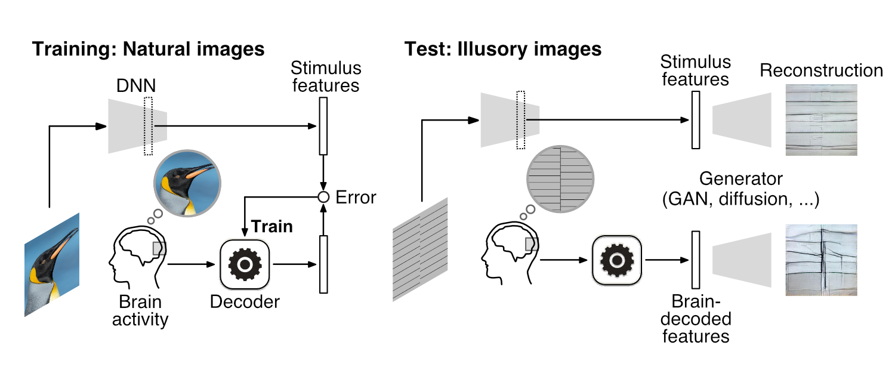

<!-- Improved compatibility of back to top link: See: https://github.com/othneildrew/Best-README-Template/pull/73 -->
<a name="readme-top"></a>
<!--
*** Thanks for checking out the Best-README-Template. If you have a suggestion
*** that would make this better, please fork the repo and create a pull request
*** or simply open an issue with the tag "enhancement".
*** Don't forget to give the project a star!
*** Thanks again! Now go create something AMAZING! :D
-->


<!-- PROJECT SHIELDS -->
<!--
*** I'm using markdown "reference style" links for readability.
*** Reference links are enclosed in brackets [ ] instead of parentheses ( ).
*** See the bottom of this document for the declaration of the reference variables
*** for contributors-url, forks-url, etc. This is an optional, concise syntax you may use.
*** https://www.markdownguide.org/basic-syntax/#reference-style-links
-->
[![Contributors][contributors-shield]][contributors-url]
[![Forks][forks-shield]][forks-url]
[![Stargazers][stars-shield]][stars-url]
[![Issues][issues-shield]][issues-url]


<!-- PROJECT LOGO -->
<br />

<h2 align="center">Reconstructing visual illusory experiences from human brain activity</h2>

  <p align="center">
    Fan Cheng, Tomoyasu Horikawa, Kei Majima, Misato Tanaka, Mohamed Abdelhack, Shuntaro C. Aoki, Jin Hirano, Yukiyasu Kamitani
    <br />
    <a href="https://github.com/KamitaniLab/IllusionReconstruction">Paper</a>
    ·
    <a href="https://2022.ccneuro.org/view_paper.php?PaperNum=1149">CCN2022</a>
    ·
    <a href="https://doi.org/10.1101/2023.06.15.545037">bioRxiv</a>
  
<div align="center">
  <a href="https://github.com/KamitaniLab/IllusionReconstruction/blob/main/">
    
  </a> 
</div>


<!-- TABLE OF CONTENTS -->
<details>
  <summary>Table of Contents</summary>
  <ol>
    <li>
      <a href="#getting-started">Getting Started</a>
      <ul>
        <li><a href="#prerequisites">Prerequisites</a></li>
        <li><a href="#installation">Installation</a></li>
      </ul>
    </li>
    <li><a href="#usage">Usage</a></li>
    <li><a href="#roadmap">Roadmap</a></li>
    <li><a href="#contributing">Contributing</a></li>
    <li><a href="#license">License</a></li>
    <li><a href="#contact">Contact</a></li>
    <li><a href="#acknowledgments">Acknowledgments</a></li>
  </ol>
</details>


<!-- GETTING STARTED -->
## Getting Started

### Installation

Clone the repo:
   ```sh
   git clone https://github.com/KamitaniLab/IllusionReconstruction.git
   ```

### Build Environment

Step1: Navigate to the directory and create the environment by running the following command.
  ```sh
  conda env create -f env.yaml

  ```
Step2: Activate the environment.
  ```sh
  conda activate brain_decoding-to-generator
  
  ```

### Downloading Dataset

To utilize this project, you'll need to download the required dataset [figShare](https://figshare.com/) and organize the dataset appropriately. After downloading data (preprocessed fMRI data, stimulus DNN features, pre-trained generator), make sure to move them to the correct locations.
 
  ```sh
  # move fMRI data files (*.h5) and DNN features (*.mat) to ./data 
  mv path_to_downloaded_fmri ./data/fmri/train_or_test
  mv path_to_downloaded_DNNfeature ./data/stimulus_feature/train_or_test/dataset_name/caffe/bvlc_reference_caffenet/ 
  
  
  # move pre-trained generator (*.pt) to ./generator
  mv path_to_downloaded_generator ./generator/generator_name
  ```


<p align="right">(<a href="#readme-top">back to top</a>)</p>


<!-- USAGE EXAMPLES -->
## Usage

Use this space to show useful examples of how a project can be used. Additional screenshots, code examples and demos work well in this space. You may also link to more resources.

_For more examples, please refer to the [Documentation](https://example.com)_

<p align="right">(<a href="#readme-top">back to top</a>)</p>


<!-- ROADMAP -->
## Roadmap

- [ ] Feature 1
- [ ] Feature 2
- [ ] Feature 3
    - [ ] Nested Feature

See the [open issues](https://github.com/github_username/repo_name/issues) for a full list of proposed features (and known issues).

<p align="right">(<a href="#readme-top">back to top</a>)</p>


<!-- CONTRIBUTING -->
## Contributing

Contributions are what make the open source community such an amazing place to learn, inspire, and create. Any contributions you make are **greatly appreciated**.

If you have a suggestion that would make this better, please fork the repo and create a pull request. You can also simply open an issue with the tag "enhancement".
Don't forget to give the project a star! Thanks again!

1. Fork the Project
2. Create your Feature Branch (`git checkout -b feature/AmazingFeature`)
3. Commit your Changes (`git commit -m 'Add some AmazingFeature'`)
4. Push to the Branch (`git push origin feature/AmazingFeature`)
5. Open a Pull Request

<p align="right">(<a href="#readme-top">back to top</a>)</p>


<!-- LICENSE -->
## License

Distributed under the MIT License. See `LICENSE.txt` for more information.

<p align="right">(<a href="#readme-top">back to top</a>)</p>


<!-- CONTACT -->
## Contact

Your Name - [@twitter_handle](https://twitter.com/twitter_handle) - email@email_client.com

Project Link: [https://github.com/github_username/repo_name](https://github.com/github_username/repo_name)

<p align="right">(<a href="#readme-top">back to top</a>)</p>


<!-- ACKNOWLEDGMENTS -->
## Acknowledgments

* []()
* []()
* []()

<p align="right">(<a href="#readme-top">back to top</a>)</p>


<!-- MARKDOWN LINKS & IMAGES -->
<!-- https://www.markdownguide.org/basic-syntax/#reference-style-links -->
[contributors-shield]: https://img.shields.io/github/contributors/KamitaniLab/IllusionReconstruction.svg?style=for-the-badge
[contributors-url]: https://github.com/KamitaniLab/IllusionReconstruction/graphs/contributors
[forks-shield]: https://img.shields.io/github/stars/KamitaniLab/IllusionReconstruction.svg?style=for-the-badge
[forks-url]: https://github.com/KamitaniLab/IllusionReconstruction/forks
[stars-shield]: https://img.shields.io/github/issues/KamitaniLab/IllusionReconstruction.svg?style=for-the-badge
[stars-url]: https://github.com/KamitaniLab/IllusionReconstruction/stargazers
[issues-shield]: https://img.shields.io/github/stars/KamitaniLab/IllusionReconstruction.svg?style=for-the-badge
[issues-url]: https://github.com/KamitaniLab/IllusionReconstruction/issues
[license-shield]: https://img.shields.io/github/license/github_username/repo_name.svg?style=for-the-badge
[license-url]: https://github.com/github_username/repo_name/blob/master/LICENSE.txt
[linkedin-shield]: https://img.shields.io/badge/-LinkedIn-black.svg?style=for-the-badge&logo=linkedin&colorB=555
[linkedin-url]: https://linkedin.com/in/linkedin_username
[product-screenshot]: images/screenshot.png
[Next.js]: https://img.shields.io/badge/next.js-000000?style=for-the-badge&logo=nextdotjs&logoColor=white
[Next-url]: https://nextjs.org/
[React.js]: https://img.shields.io/badge/React-20232A?style=for-the-badge&logo=react&logoColor=61DAFB
[React-url]: https://reactjs.org/
[Vue.js]: https://img.shields.io/badge/Vue.js-35495E?style=for-the-badge&logo=vuedotjs&logoColor=4FC08D
[Vue-url]: https://vuejs.org/
[Angular.io]: https://img.shields.io/badge/Angular-DD0031?style=for-the-badge&logo=angular&logoColor=white
[Angular-url]: https://angular.io/
[Svelte.dev]: https://img.shields.io/badge/Svelte-4A4A55?style=for-the-badge&logo=svelte&logoColor=FF3E00
[Svelte-url]: https://svelte.dev/
[Laravel.com]: https://img.shields.io/badge/Laravel-FF2D20?style=for-the-badge&logo=laravel&logoColor=white
[Laravel-url]: https://laravel.com
[Bootstrap.com]: https://img.shields.io/badge/Bootstrap-563D7C?style=for-the-badge&logo=bootstrap&logoColor=white
[Bootstrap-url]: https://getbootstrap.com
[JQuery.com]: https://img.shields.io/badge/jQuery-0769AD?style=for-the-badge&logo=jquery&logoColor=white
[JQuery-url]: https://jquery.com 
